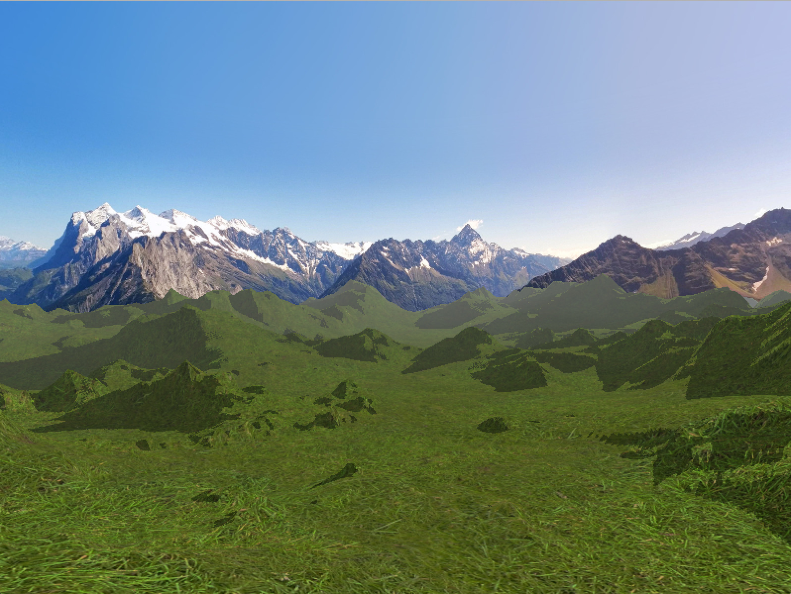

## Parallel Split Shadow Mapping

This demonstrate how to use PSSMCameraRig to have Parallel Split Shadow Mapping applied on a scene.

This example is derived from the shader terrain sample of Panda3D (https://github.com/panda3d/panda3d/tree/master/samples/shader-terrain) and PSSM plugin of RenderPipeline by tobspr (https://github.com/tobspr/RenderPipeline)

Shortcuts :

* s : Switch between traditional shadow mapping and PSSM
* f : Freeze PSSM update
* g : Toggle fog
* F3 : Toggle wireframe mode
* F5 : Toggle buffer viewer

* Escape : Exit the sample
